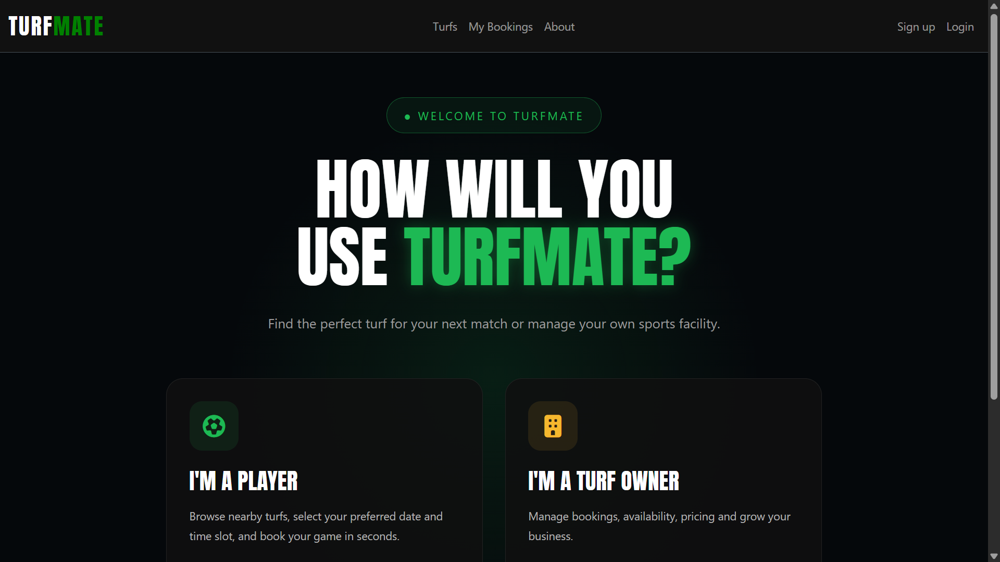
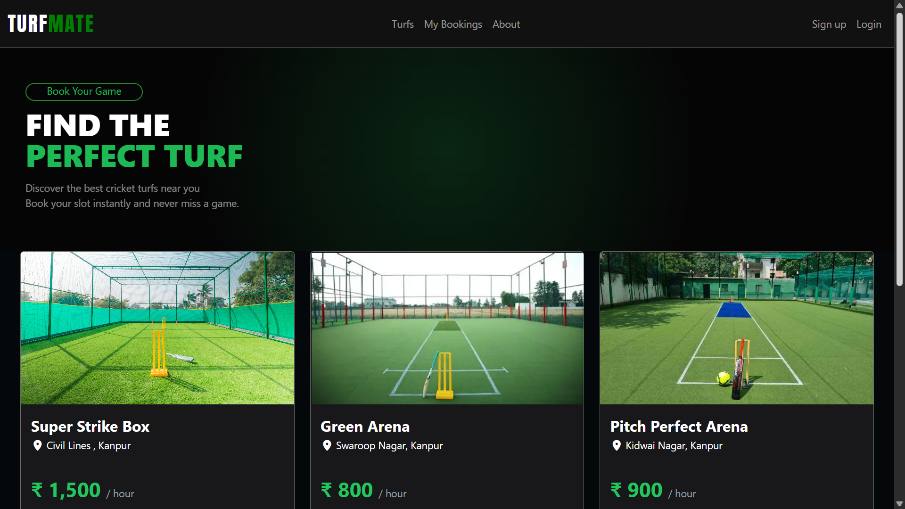
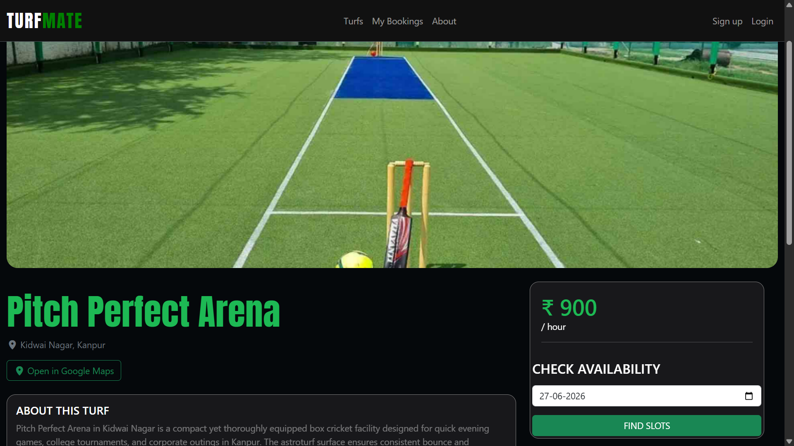
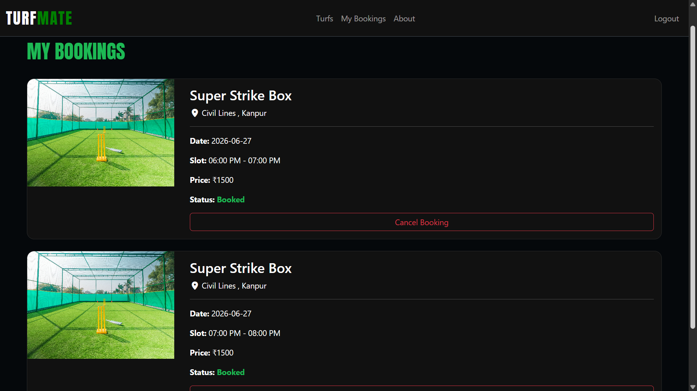
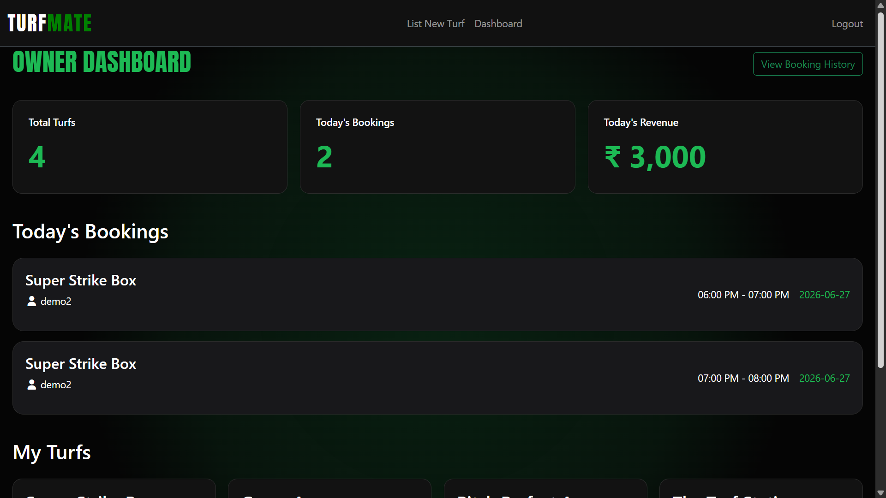
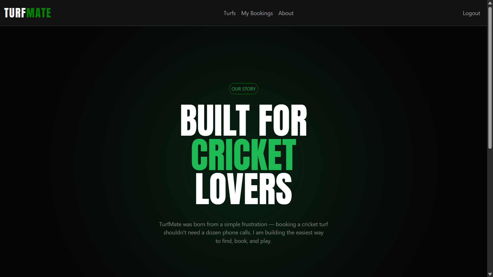
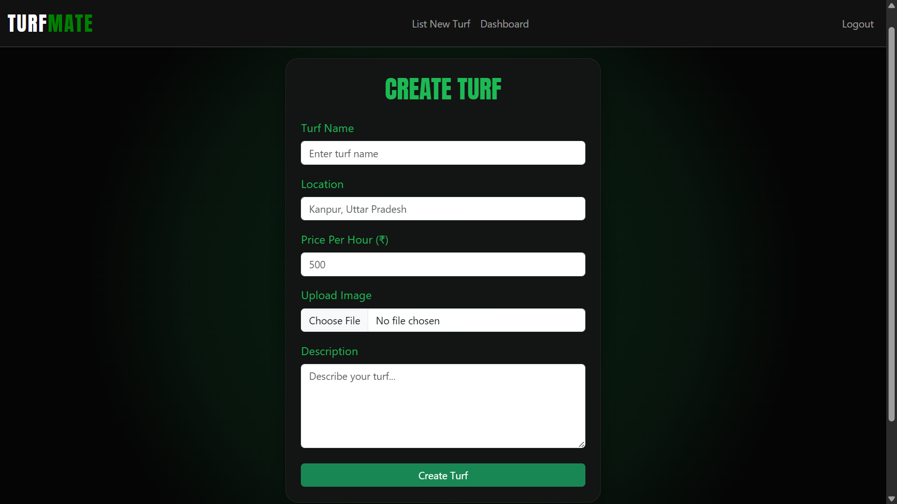

# 🏏 TurfMate

**TurfMate** is a full-stack web application that simplifies sports turf booking by allowing users to browse turfs, check real-time slot availability, and reserve playing slots online. It also provides a dedicated owner dashboard to manage turfs and monitor bookings.

> Built using **Node.js, Express.js, MongoDB, EJS, Passport.js, and Cloudinary**.

---

## 🚀 Live Demo

🔗 https://turfmate-qzfp.onrender.com/

---

# ✨ Features

## 👤 User Features

- User Registration & Login
- Secure Authentication using Passport.js
- Browse all available turfs
- View detailed turf information
- Check slot availability for a selected date
- Book one or multiple slots
- Prevention of double booking
- Prevention of booking past time slots
- View all personal bookings
- Cancel bookings
- Write reviews for turfs
- Delete own reviews only

---

## 🏟 Turf Features

- Beautiful turf listing page
- Turf details page
- Pricing information
- Reviews and ratings
- Real-time slot availability

---

## 👨‍💼 Owner Features

- Separate Owner Login
- Owner Dashboard
- Add new turf
- Edit existing turf
- Delete turf
- View today's bookings
- View booking history
- Track today's revenue
- Manage all owned turfs

---

## 📸 Image Upload

- Cloudinary integration
- Upload turf images
- Secure cloud storage
- Optimized image delivery

---

## 🔒 Security Features

- Password hashing using Passport Local Mongoose
- Authentication middleware
- Authorization checks
- Owner-only routes
- Review ownership validation
- Session management using Mongo Store
- Flash messages
- Protected booking routes

---

# 🛠 Tech Stack

## Frontend

- HTML5
- CSS3
- Bootstrap 5
- EJS
- JavaScript

## Backend

- Node.js
- Express.js

## Database

- MongoDB Atlas
- Mongoose

## Authentication

- Passport.js
- Passport Local
- Express Session

## Cloud Storage

- Cloudinary
- Multer

---

# 📂 Project Structure

```
TurfMate/
│
├── controllers/
├── models/
├── routes/
├── middleware.js
├── cloudConfig.js
├── public/
│   ├── css/
│   ├── js/
│   └── images/
│
├── views/
│   ├── layouts/
│   ├── turfs/
│   ├── owner/
│   ├── users/
│   ├── bookings/
│   └── includes/
│
├── utils/
├── init/
├── app.js
├── package.json
└── README.md
```

---

# ⚙️ Installation

## Clone Repository

```bash
git clone https://github.com/hardikBajpai/TurfMate.git
```

Go into the project

```bash
cd TurfMate
```

Install dependencies

```bash
npm install
```

---

# 🔑 Environment Variables

Create a `.env` file in the project root.

```env
ATLASDB_URL=your_mongodb_connection_string

SECRET=your_session_secret

CLOUD_NAME=your_cloudinary_name
CLOUD_API_KEY=your_cloudinary_api_key
CLOUD_API_SECRET=your_cloudinary_api_secret
```

---

# ▶️ Running Locally


```bash
nodemon app.js
```

Open

```
http://localhost:8080/home
```

---

# 📷 Screenshots

## Home Page



---

## Turf Details



---

## Slot Booking



---

## My Bookings



---

## Owner Dashboard



---

## About



---

## Add Turf



---

# 🔄 Booking Workflow

1. User signs up or logs in.
2. Browse available turfs.
3. Select a date.
4. View available slots.
5. Choose one or more slots.
6. Booking is validated:
   - Past slots cannot be booked.
   - Already booked slots cannot be selected.
7. Booking is saved.
8. User can later cancel the booking.

---

# 🔐 Authentication & Authorization

### Users

- Register
- Login
- Logout

### Owners

- Owner-specific dashboard
- Turf management
- Booking management

### Authorization

- Only logged-in users can book slots.
- Only owners can manage turfs.
- Only review authors can delete their reviews.

---

# 🌟 Future Improvements

- Google Maps integration
- Online payments
- Email booking confirmation
- Notifications
- Turf search & filtering
- Favorite turfs
- Mobile responsive improvements
- Admin panel
- Booking analytics
- QR Code booking verification

---

# 📦 Deployment

- **Backend:** Render
- **Database:** MongoDB Atlas
- **Image Storage:** Cloudinary

---

# 👨‍💻 Author

**Hardik Bajpai**

GitHub: https://github.com/hardikBajpai

---

# 📄 License

This project is licensed under the MIT License.

---

## ⭐ If you like this project, don't forget to star the repository!